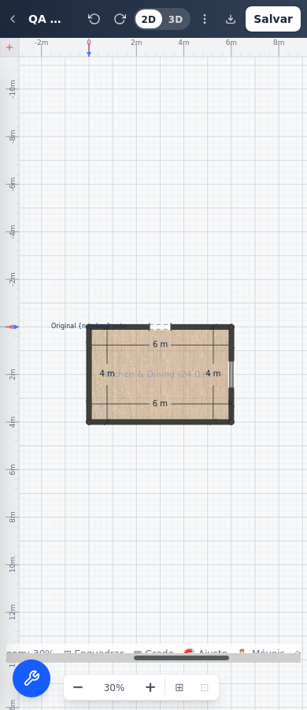
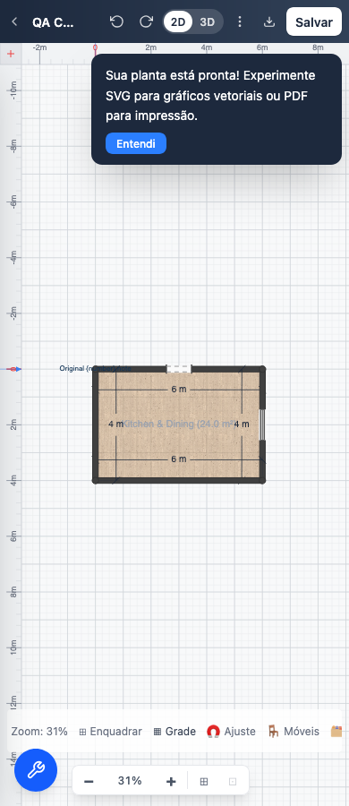

# Phone status-bar scrollbar clearance

The Linux Firefox CI failure at 390 px occurred while clicking the Portuguese
Grid button. The trace reports the containing status bar intercepting the click;
the screenshot shows its horizontal scrollbar covering the button text. An
unchanged macOS Firefox reproduction passed, so that was insufficient evidence
for dismissing the Linux failure.

The repair gives the mobile bar a 48 px minimum height and centers the flex
items, leaving space for classic horizontal scrollbars. Desktop styling is
unchanged. The regression keeps real pointer clicks and exact state/data checks,
adds a requirement that buttons fit their text line, and saves a phone screenshot.

Production build `35608` passed. All six desktop/phone cases across Chromium,
Firefox and WebKit passed in `85538` (exit 0, 1.8 minutes). Focused Firefox
screenshot run `43494` also passed; its image was inspected. Logs:
`/tmp/web-mobile-statusbar-{build,browser,visual}.log`.

## Before: Linux Firefox CI

## After: local macOS Firefox

These images come from different operating systems. The local result confirms
readable controls and working clicks on macOS. The original Linux CI environment
subsequently passed in [run 34735405519](https://github.com/laanlabs/openPlan3D/actions/runs/34735405519):
Firefox shard 3 completed all 74 tests in 5.6 minutes. All 18 browser shards passed.
The Linux failure is now qualified as repaired. The images above remain a visual
comparison across different operating systems.
